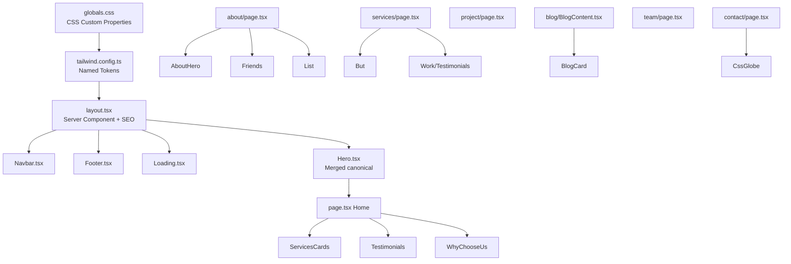

# Design Document: Midnight & Gold Redesign

## Overview

This document describes the technical design for the complete visual redesign of the TechExa Vision website from its current inconsistent blue/purple/green theme to a unified **Midnight & Gold** aesthetic.

The redesign is a **pure styling migration** — no new routes, no new data models, no backend changes. Every change is confined to CSS custom properties, Tailwind configuration, and the className/style attributes of existing React components. Two duplicate Hero components (`hero.tsx` and `hero-new.tsx`) will be merged into a single canonical gold-themed component, and `layout.tsx` will be refactored into a proper Next.js server component with correct SEO metadata.

### Key Constraints

- Stack: Next.js 15 App Router + React 19 + TypeScript + Tailwind CSS v4 + Framer Motion
- Location: `khanweb/` directory
- Zero legacy colours after completion — no `blue-`, `purple-`, or `green-` brand tokens anywhere
- Font change: `Outfit` for headings, `Geist` for body text
- New Home page sections: Testimonials and "Why Choose TechExa Vision"

---

## Architecture

The redesign follows a **top-down token propagation** pattern:

```
globals.css (CSS custom properties)
    └── tailwind.config.ts (named colour tokens)
            └── Shared components (Navbar, Footer, Loading, Hero)
                    └── Page-level components (7 pages + their sub-components)
```

Changes flow from the design system outward. Because most components use hardcoded Tailwind classes rather than CSS variables, each file must be updated individually. The token definitions in `globals.css` and `tailwind.config.ts` provide the canonical source of truth; all component classes must reference these tokens or the approved hex values.



---

## Components and Interfaces

### Design System Layer

**`globals.css`** — CSS custom properties and utility classes  
**`tailwind.config.ts`** — Named colour tokens and shadow/gradient extensions

### Layout Layer

**`layout.tsx`** (refactored to server component)
- Removes `"use client"` directive
- Adds `export const metadata: Metadata` for SEO
- Loads `Outfit` (headings) and `Geist` (body) fonts via `next/font/google`
- Delegates route-change loading state to a new `ClientLayout` sub-component that carries `"use client"`

**`ClientLayout.tsx`** (new sub-component, client)
- Owns `usePathname`, `useState`, `useEffect` for loading state
- Renders `<Navbar />`, `<Loading />`, `children`, `<Footer />`

### Shared Components

| Component | Change Summary |
|-----------|---------------|
| `Navbar.tsx` | Blue → Gold logo glow, gradient, underline, CTA button |
| `Footer.tsx` | Blue → Gold social icons, links, logo glow, floating shapes |
| `Loading.tsx` | Blue → Gold progress bar gradient and logo glow |
| `Hero.tsx` (merged) | New canonical component replacing both `hero.tsx` and `hero-new.tsx` |

### Hero Merge Strategy

`hero.tsx` (green theme, uses `BackgroundBeams` + `MovingBorderButton`) and `hero-new.tsx` (blue theme, simpler) are merged into a single `src/app/components/Hero.tsx`:

- Keeps the richer structure of `hero-new.tsx` (logo, title, subtitle, CTA buttons, stats, scroll indicator)
- Adopts the badge and `BackgroundBeams` from `hero.tsx` for visual richness
- Replaces all blue/green/purple with Gold palette
- Exports as `HeroSection` (named export) to maintain compatibility with `page.tsx`
- After merge, `hero.tsx` is deleted and `hero-new.tsx` is deleted; `page.tsx` import path updated

### New Home Page Sections

**`Testimonials.tsx`** (extracted/renamed from `Work.tsx`)  
- `Work.tsx` already contains testimonial data; it is updated to gold theme
- Home page imports it directly

**`WhyChooseUs.tsx`** (new component)  
- "Why Choose TechExa Vision" block with 4–6 differentiator cards
- Gold icon accents, Surface_Color card backgrounds, gold hover borders

### Page Components

All 7 pages receive className-level updates only (no structural changes except Home page additions):

| Page | Files Updated |
|------|--------------|
| Home | `page.tsx`, `Hero.tsx`, `services-new.tsx` |
| About | `about/page.tsx`, `AboutHero.tsx`, `Friends.tsx`, `List.tsx` |
| Services | `services/page.tsx`, `But.tsx`, `Work.tsx` |
| Projects | `project/page.tsx` |
| Blog | `blog/BlogContent.tsx`, `blog-card.tsx`, `blog/[slug]/page.tsx` |
| Team | `team/page.tsx` |
| Contact | `contact/page.tsx`, `CssGlobe.tsx` |

---

## Data Models

This feature introduces no new data models. The only "data" changes are:

1. **Colour token definitions** — CSS custom properties and Tailwind config entries (static configuration)
2. **Font variables** — `--font-outfit` and `--font-geist` CSS variables injected by `next/font`
3. **SEO metadata** — Static `Metadata` object in `layout.tsx`
4. **New content** — Static arrays for Testimonials (already exists in `Work.tsx`) and WhyChooseUs cards

### Colour Token Reference

| Token Name | Hex Value | HSL Equivalent | Usage |
|-----------|-----------|---------------|-------|
| `--background` / `midnight` | `#09090B` | `240 10% 4%` | Page backgrounds |
| `--card` / `surface` | `#18181B` | `240 5% 10%` | Card/panel surfaces |
| `--primary` / `gold` | `#D4AF37` | `46 65% 52%` | CTAs, icons, highlights |
| `--foreground` | `#FAFAFA` | `0 0% 98%` | Primary text |
| `--muted-foreground` | `#A1A1AA` | `240 4% 65%` | Secondary text |
| `--border` / `border-subtle` | `#27272A` | `240 4% 16%` | Borders |
| Gold gradient end | `#F0D060` | `48 83% 66%` | Gradient highlights |
| Gold glow shadow | `rgba(212,175,55,0.3)` | — | Box shadows |

### Font Configuration

```typescript
// layout.tsx (server component)
import { Outfit, Geist } from "next/font/google";

const outfit = Outfit({
  subsets: ["latin"],
  variable: "--font-outfit",
  display: "swap",
});

const geist = Geist({
  subsets: ["latin"],
  variable: "--font-geist",
  display: "swap",
});
```

`tailwind.config.ts` font families updated:
```typescript
fontFamily: {
  sans: ["var(--font-geist)", "system-ui", "sans-serif"],
  heading: ["var(--font-outfit)", "system-ui", "sans-serif"],
}
```

### SEO Metadata

```typescript
export const metadata: Metadata = {
  title: {
    default: "TechExa Vision — Premium Software Development",
    template: "%s | TechExa Vision",
  },
  description:
    "TechExa Vision delivers cutting-edge web, mobile, and AI solutions. Transform your business with our expert team in Karachi, Pakistan.",
  keywords: ["software development", "web design", "mobile apps", "AI solutions", "TechExa Vision", "Karachi"],
  authors: [{ name: "TechExa Vision" }],
  openGraph: {
    type: "website",
    locale: "en_US",
    url: "https://techexavision.com",
    siteName: "TechExa Vision",
    title: "TechExa Vision — Premium Software Development",
    description: "Cutting-edge software solutions with modern design and exceptional performance.",
    images: [{ url: "/logo1.jpg", width: 400, height: 400, alt: "TechExa Vision Logo" }],
  },
  twitter: {
    card: "summary_large_image",
    title: "TechExa Vision",
    description: "Premium software development from Karachi, Pakistan.",
  },
};
```

---

## Correctness Properties

*A property is a characteristic or behavior that should hold true across all valid executions of a system — essentially, a formal statement about what the system should do. Properties serve as the bridge between human-readable specifications and machine-verifiable correctness guarantees.*

The majority of acceptance criteria in this spec are static configuration and styling checks (SMOKE classification) — they verify that specific strings exist or do not exist in specific files. These are best validated with snapshot tests and content-assertion tests, not property-based tests.

However, Requirements 14.1–14.5 define **universal properties** that must hold across the entire file set: no legacy colour values should appear in any source file. These are genuine "for all" properties — the set of files is the input space, and the property must hold for every element of that set.

### Property 1: No Legacy Blue Hex Values in Source Files

*For any* `.tsx` or `.css` source file in the `khanweb/src/` directory, the file content SHALL NOT contain any of the following hardcoded Legacy_Blue hex values: `#3B82F6`, `#2563EB`, `#60A5FA`, `#1D4ED8`, `#3b82f6`, `#2563eb`, `#60a5fa`.

**Validates: Requirements 14.1**

### Property 2: No Legacy Purple Hex Values in Source Files

*For any* `.tsx` or `.css` source file in the `khanweb/src/` directory, the file content SHALL NOT contain any of the following hardcoded Legacy_Purple hex values: `#8B5CF6`, `#7C3AED`, `#A78BFA`, `#6D28D9`, `#8b5cf6`, `#7c3aed`, `#a78bfa`.

**Validates: Requirements 14.2**

### Property 3: No Legacy Green Hex Values in Source Files

*For any* `.tsx` or `.css` source file in the `khanweb/src/` directory, the file content SHALL NOT contain any of the following hardcoded Legacy_Green hex values: `#255F38`, `#1A3636`, `#73f3f3`, `#006A71`, `#2f7a47`, `#4ade80`, `#255f38`, `#1a3636`.

**Validates: Requirements 14.3**

### Property 4: No Legacy Blue/Purple Tailwind Decorative Classes in TSX Files

*For any* `.tsx` source file in the `khanweb/src/` directory, the file content SHALL NOT contain Tailwind utility classes that reference the `blue-` or `purple-` colour scales for decorative or brand purposes. Specifically, patterns matching `bg-blue-\d`, `text-blue-\d`, `from-blue-\d`, `to-blue-\d`, `via-blue-\d`, `border-blue-\d`, `bg-purple-\d`, `text-purple-\d`, `from-purple-\d`, `to-purple-\d`, `via-purple-\d`, `border-purple-\d`, `shadow-blue-`, `shadow-purple-` SHALL NOT appear.

**Validates: Requirements 14.4**

### Property 5: No Legacy Green Tailwind Decorative Classes in TSX Files

*For any* `.tsx` source file in the `khanweb/src/` directory, the file content SHALL NOT contain Tailwind utility classes referencing the `green-` colour scale for decorative or brand purposes. Patterns matching `bg-green-\d`, `text-green-\d`, `from-green-\d`, `to-green-\d`, `border-green-\d` SHALL NOT appear.

**Validates: Requirements 14.5**

---

## Error Handling

Since this is a pure styling migration, runtime errors are not a primary concern. The relevant failure modes are:

### Build-Time Failures

| Failure | Cause | Mitigation |
|---------|-------|-----------|
| TypeScript error in `layout.tsx` | `usePathname` used in server component | Move to `ClientLayout.tsx` sub-component with `"use client"` |
| Missing font variable | `Outfit`/`Geist` not loaded before use | Load fonts in `layout.tsx` and pass variables to `<html>` className |
| Import error after hero merge | `page.tsx` still imports from deleted `hero-new.tsx` | Update import path to new `Hero.tsx` before deleting old files |
| Tailwind class not found | New token names (`bg-gold`, `bg-midnight`) not in config | Add tokens to `tailwind.config.ts` before using in components |

### Visual Regression Risks

| Risk | Mitigation |
|------|-----------|
| Missed legacy colour in a deeply nested component | Run Property tests 1–5 after all changes |
| Gold gradient looks washed out on certain screens | Use `#D4AF37` → `#F0D060` gradient (not pure white) |
| `Outfit` font not loading (network) | `display: "swap"` ensures fallback to system font |
| `CssGlobe` external image URL fails | Existing behaviour; not changed by this redesign |

### Migration Order (Dependency-Safe)

To avoid broken intermediate states, changes must be applied in this order:

1. `globals.css` — CSS variables and utility classes
2. `tailwind.config.ts` — colour tokens and shadows
3. `layout.tsx` + `ClientLayout.tsx` — server component refactor + fonts
4. `Loading.tsx` — uses gold glow
5. `Navbar.tsx`, `Footer.tsx` — shared layout components
6. `Hero.tsx` (merge) — canonical hero, update `page.tsx` import, delete old files
7. `services-new.tsx`, `WhyChooseUs.tsx` (new), `Work.tsx` — home page sections
8. `page.tsx` (Home) — wire up new sections
9. All remaining pages and components (About, Services, Projects, Blog, Team, Contact)

---

## Testing Strategy

### Overview

This feature is a styling migration. The appropriate testing strategy is:

- **Smoke tests**: Verify that CSS variables, Tailwind tokens, and utility classes are correctly defined (static file content assertions)
- **Property tests**: Verify the universal "no legacy colour" invariant across all source files (Requirements 14.1–14.5)
- **Visual regression tests**: Manual review of each page in a browser after implementation (automated visual regression is out of scope for this spec)

PBT is appropriate here specifically for the "no legacy colour leakage" properties because:
- The input space is the set of all source files (varies with codebase growth)
- The property must hold for every element of that set
- 100 iterations over file paths would catch any file missed during manual review
- The operation is pure (file read + string search) and cost-free

### Property-Based Testing

**Library**: [fast-check](https://fast-check.dev/) (TypeScript-native, works with Jest/Vitest)

**Test file location**: `khanweb/src/__tests__/colour-consistency.property.test.ts`

**Configuration**: Minimum 100 iterations per property (fast-check default is 100 runs)

Each property test:
1. Enumerates all `.tsx` and `.css` files under `khanweb/src/`
2. Uses fast-check to generate arbitrary file indices from that list
3. Reads the file content
4. Asserts the content does not contain any forbidden colour string

**Tag format**: `// Feature: midnight-gold-redesign, Property {N}: {property_text}`

Example structure:
```typescript
// Feature: midnight-gold-redesign, Property 1: No Legacy Blue Hex Values in Source Files
it("Property 1: no legacy blue hex values in any source file", () => {
  const files = getAllSourceFiles("khanweb/src");
  fc.assert(
    fc.property(fc.constantFrom(...files), (filePath) => {
      const content = fs.readFileSync(filePath, "utf-8");
      const legacyBlue = ["#3B82F6", "#2563EB", "#60A5FA", "#3b82f6", "#2563eb", "#60a5fa"];
      return legacyBlue.every((hex) => !content.includes(hex));
    }),
    { numRuns: 100 }
  );
});
```

### Smoke Tests

**Test file location**: `khanweb/src/__tests__/design-system.smoke.test.ts`

Smoke tests use simple `fs.readFileSync` + `expect(content).toContain(...)` assertions:

- `globals.css` contains `--background: 240 10% 4%` (or equivalent HSL for `#09090B`)
- `globals.css` contains `--primary: 46 65% 52%` (or equivalent HSL for `#D4AF37`)
- `globals.css` contains `--ring: 46 65% 52%`
- `globals.css` `.dark` block contains gold values, not legacy green
- `globals.css` `.glass` class uses `rgba(9, 9, 11, 0.7)`
- `globals.css` `.text-gradient` uses `#D4AF37`
- `globals.css` scrollbar thumb uses `#D4AF37`
- `tailwind.config.ts` contains `gold: "#D4AF37"`
- `tailwind.config.ts` contains `midnight: "#09090B"`
- `tailwind.config.ts` contains `surface: "#18181B"`
- `layout.tsx` does NOT contain `"use client"` at the top level
- `layout.tsx` contains `export const metadata`
- `layout.tsx` contains `Outfit` font import

### Unit Tests

No new unit tests are required for this feature beyond the smoke and property tests above. The components themselves are not changing their logic — only their visual styling.

### Manual Visual Verification Checklist

After implementation, each page should be visually verified in a browser:

- [ ] Home: Gold hero orbs, gold CTA buttons, gold stat gradients, Testimonials section, Why Choose Us section
- [ ] About: Gold sparkles, gold dividers, gold card hover borders
- [ ] Services: Gold service icons, gold hover border gradient, gold stats
- [ ] Projects: Gold background orbs, gold card hover, gold tag badges, gold CTA
- [ ] Blog: Gold badge, gold heading gradient, gold card hover, gold read-more links
- [ ] Team: Gold heading, gold featured card, gold role text, gold social hovers
- [ ] Contact: Gold globe glow, gold heading, gold form card border, gold submit button
- [ ] Navbar: Gold logo glow, gold brand gradient, gold underline, gold CTA
- [ ] Footer: Gold social icons, gold link hovers, gold logo glow
- [ ] Loading: Gold progress bar, gold logo glow
- [ ] Scrollbar: Gold thumb on all pages
